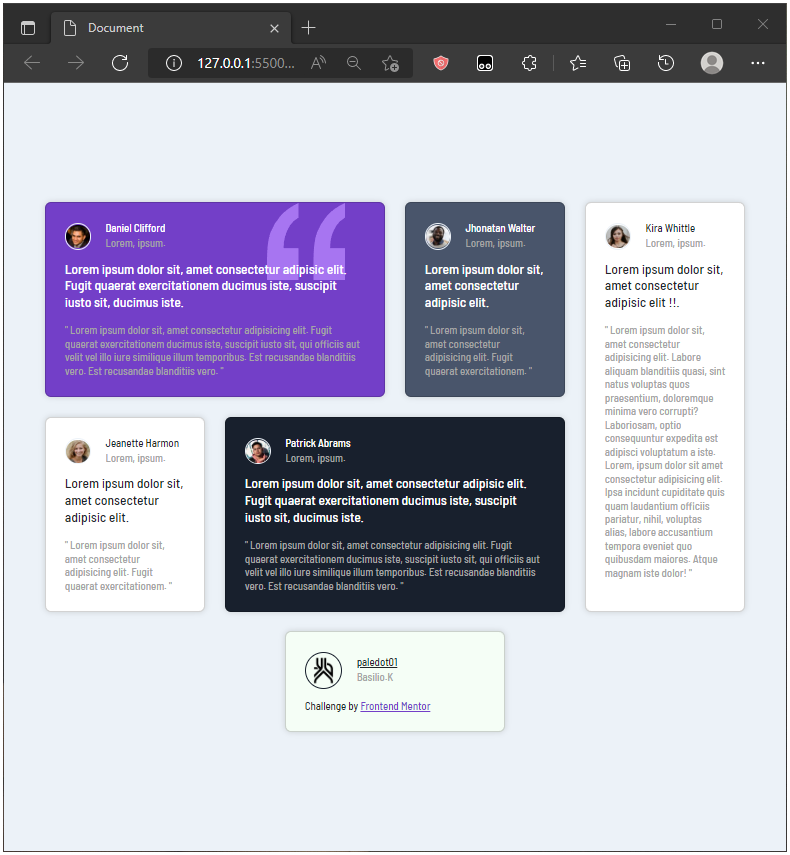
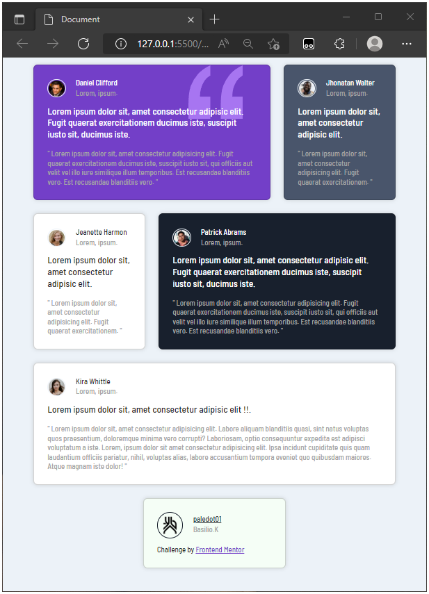

## Practica 01

| _______________ | _____________ |  |
| ----------- | ----------- | ----------- |
| ![][img_1] | ![][img_2] | ![][img_3]

 

#### :eye: Live Preview :
https://paledot02.github.io/Exercises_Bootstrap_01/

[img_1]: ./Exercise_01/images/screenshot_1.png
[img_2]: ./Exercise_01/images/screenshot_2.png
[img_3]: ./Exercise_01/images/screenshot_3.png